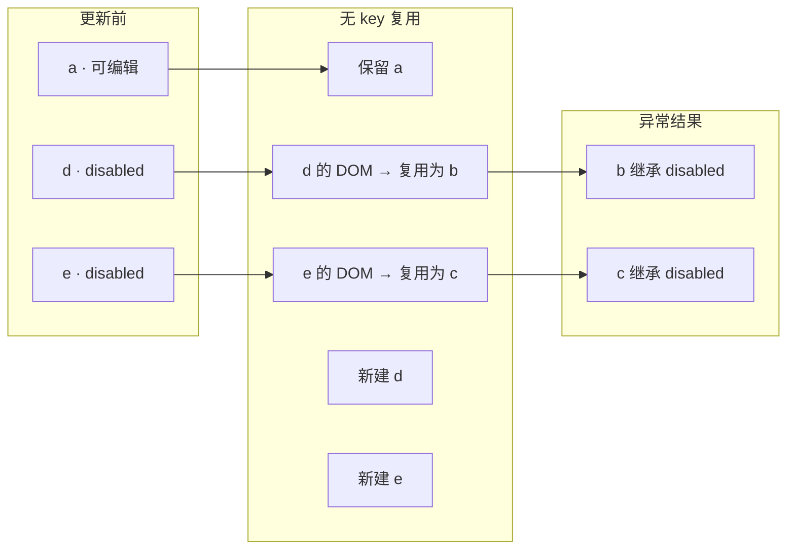

## 一、为什么需要虚拟 DOM 与 Diff

直接操作真实 DOM 成本高（重排/重绘、性能差）。Vue 用 **虚拟 DOM（VNode）** 对真实 DOM 做轻量 JS 描述，例如：

```js
{ tag: 'input', props: { disabled: true } }
```

当数据变化时，Vue 生成**新 VNode**，与**旧 VNode** 做 **Diff（对比）**，算出最小变更集再应用到真实 DOM，避免全量重渲染。这个对比过程就是 **Diff 算法**。

## 二、Diff 的两类场景

### 1. 普通元素（非列表）

同层两个 VNode 的对比流程：

1. **判断是否同一节点**：先比 `key`，无 `key` 则比标签名/组件名；不同则销毁旧节点、创建新节点。
2. **同一节点则增量更新**：仅对比并更新 props、样式、事件等差异项（如 `disabled` 变化）。
3. **递归处理子节点**：容器节点继续向下 Diff。

### 2. 列表元素（key 的关键作用）

以列表从 `[a, d, e]` 变为 `[a, b, c, d, e]` 为例：

- **无 key**：Vue 就地复用——原 d 的 DOM 被改成 b，原 e 的 DOM 被改成 c，再新建 d/e。
- **有 key**：Vue 通过 key 映射精准定位，在 a 与 d 之间插入 b/c，d/e 的 DOM 保持不变。

## 三、key 的官方语义

> `key` 主要供 Vue 虚拟 DOM 算法在对比新旧节点时识别 VNode 身份。不使用 `key` 时，Vue 会尽可能就地修改/复用同类型元素；使用 `key` 时，则依据 key 变化重排、插入或移除节点。

约束：**同一父节点下的子元素 key 必须唯一**，重复 key 会导致渲染异常。

## 四、key 机制同样适用于 v-if

一个常见误区是"key 只对 `v-for` 有用"。实际上，`v-if` 在兄弟节点中间位置动态插入新节点时，这些节点同样作为**同级子节点**参与 Diff。

以 `el-descriptions` 内的 `el-descriptions-item` 为例，抽象为五个节点：

| 节点    | 初始状态             | 属性         |
| ----- | ---------------- | ---------- |
| a     | 显示               | 可编辑        |
| b / c | 隐藏（`v-if=false`） | 可编辑        |
| d / e | 显示               | `disabled` |

当 a 取值变化、触发 b/c 展示时，未加 `key` 的情况下 Vue 可能复用 d/e 的 DOM 来渲染 b/c——**这就是就地复用机制在 v-if 场景下的体现**。

## 五、如果不遵循 key 规范，会发生什么

以动态表单为例：节点 a 始终显示且可编辑；节点 b、c 由 `v-if` 控制动态展示，本应可编辑；下方节点 d、e 始终展示且 `disabled`。

**未加 key 的写法（有问题的写法）：**

```vue
<el-descriptions>
    <el-descriptions-item label="节点 a">
        <el-input v-model="row.a" style="width: 100%" />
    </el-descriptions-item>
    <el-descriptions-item label="节点 b" v-if="showFieldB">
        <el-input v-model="row.b" style="width: 100%" />
    </el-descriptions-item>
    <el-descriptions-item label="节点 c" v-if="showFieldC">
        <el-input v-model="row.c" style="width: 100%" />
    </el-descriptions-item>
    <el-descriptions-item label="节点 d">
        <el-input v-model="row.d" style="width: 100%" disabled />
    </el-descriptions-item>
    <el-descriptions-item label="节点 e">
        <el-input v-model="row.e" style="width: 100%" disabled />
    </el-descriptions-item>
</el-descriptions>
```

**后果：** 触发动态展示后，节点 b、c **均变为不可编辑**，表现与下方 `disabled` 字段一致，但 `v-model` 数据绑定本身并未出错。

**根因（Diff 复用路径）：** 无 `key` 时，列表从 `[a, d, e]` 变为 `[a, b, c, d, e]`，新插入的可编辑输入框复用了后方已存在的 `disabled` 输入框 DOM，仅更新了标签等表层信息，却**保留了** **`disabled`** **属性**——这就是"属性继承"问题的本质。



## 六、正确做法：为条件渲染节点加唯一 key

让 Vue 将其识别为独立节点，避免与下方 `disabled` 输入框发生就地复用：

```vue
<el-descriptions-item label="节点 b" v-if="showFieldB" key="editable-b">
    <el-input v-model="row.b" style="width: 100%" />
</el-descriptions-item>
<el-descriptions-item label="节点 c" v-if="showFieldC" key="editable-c">
    <el-input v-model="row.c" style="width: 100%" />
</el-descriptions-item>
```

**实践建议：**

- 优先将 `key` 加在带 `v-if` 的**外层节点**上，语义更清晰，也更贴合 Diff 场景。
- `key` 加在内部 `el-input` 上同样有效，但外层加 `key` 是更推荐的做法。

## 七、可验证示例：key 如何影响 Diff

```vue
<template>
  <div>
    <!-- 无 key：可能复用 DOM，导致 disabled 被继承 -->
    <div v-for="item in listWithoutKey" class="item">
      <input :disabled="item.disabled" placeholder="无 key" />
    </div>

    <hr />

    <!-- 有 key：精准插入，避免错误复用 -->
    <div v-for="item in listWithKey" :key="item.id" class="item">
      <input :disabled="item.disabled" placeholder="有 key" />
    </div>

    <button @click="showBC">显示 BC</button>
  </div>
</template>

<script>
export default {
  data() {
    return {
      listWithoutKey: [
        { name: 'a', disabled: false },
        { name: 'd', disabled: true },
        { name: 'e', disabled: true }
      ],
      listWithKey: [
        { id: 1, name: 'a', disabled: false },
        { id: 4, name: 'd', disabled: true },
        { id: 5, name: 'e', disabled: true }
      ]
    };
  },
  methods: {
    showBC() {
      this.listWithoutKey.splice(1, 0,
        { name: 'b', disabled: false },
        { name: 'c', disabled: false }
      );

      this.listWithKey.splice(1, 0,
        { id: 2, name: 'b', disabled: false },
        { id: 3, name: 'c', disabled: false }
      );
    }
  }
};
</script>

<style scoped>
.item { margin: 5px 0; }
input { margin-left: 10px; }
</style>
```

有 `key` 时，Vue 通过 id 映射直接插入 b/c，d/e 的 DOM 不被复用，属性保持正确。

## 八、总结

| 要点         | 说明                                                         |
| ---------- | ---------------------------------------------------------- |
| 核心机制       | Vue Diff 采用同层比较 + key 优化，以最小 DOM 操作完成更新                    |
| key 的作用    | 标识 VNode 身份，让 Vue 精准定位是"复用"还是"新建"                          |
| 不加 key 的后果 | `v-if`/`v-for` 动态插入同级节点时，DOM 就地复用，新节点可能继承旧属性（如 `disabled`） |
| 正确做法       | 为条件渲染节点添加唯一 `key`，强制 Vue 创建独立 DOM                          |
| 适用范围       | 不仅限于 `v-for`，`v-if` 动态插入的同级节点同样需要 `key`                    |

---

<p align="center">
    <a href="https://github.com/dkbnull/hello-wiki/blob/main/21-Vue/01-Vue%20%E8%99%9A%E6%8B%9F%20DOM%20Diff%20%E7%AE%97%E6%B3%95%E4%B8%8E%20key%20%E6%9C%BA%E5%88%B6%E5%8E%9F%E7%90%86.md" target="_blank">
        
    </a>
    <a href="https://gitee.com/dkbnull/hello-wiki/blob/main/21-Vue/01-Vue%20%E8%99%9A%E6%8B%9F%20DOM%20Diff%20%E7%AE%97%E6%B3%95%E4%B8%8E%20key%20%E6%9C%BA%E5%88%B6%E5%8E%9F%E7%90%86.md" target="_blank">
        
    </a>
    <a href="https://mp.weixin.qq.com/s/2YWaZ1RJl3_K1s_GHcIYVw" target="_blank">
       
    </a>
    <a href="https://juejin.cn/post/7655245911812341806" target="_blank">
       
    </a>
    <a href="https://zhuanlan.zhihu.com/p/2053624428425123221" target="_blank">
       
    </a>
</p>